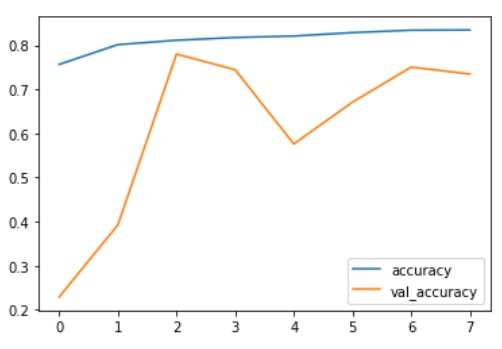
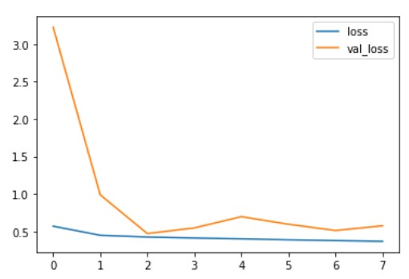
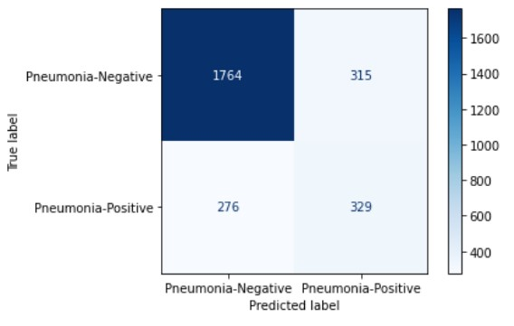
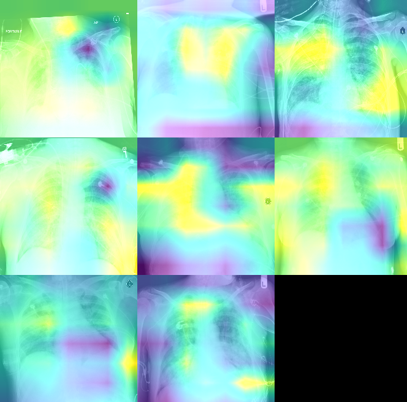

# Pneumonia_Classification

### Project Summary:
I want to build a CNN model that can properly classify patients into either 0 for not having pneumonia or 1 for having pneumonia. Taking a step further, instead of only producing predictions, I will analyze my model in two ways.
1. Creating a mechanism to inspect and ensure our model makes rational predictions
2. Evaluating results not on average accuracy but with recall and precision

### Data Source:
RSNA Pneumonia Detection Challenge 
(https://www.kaggle.com/c/rsna-pneumonia-detection-challenge)

### Project Steps:
1. Extract labels from the given csv file and images from dicom files. 
2. Use Augmentor to create augmented images for 1s. 
3. Create csv files with columns that specified (image_path, label), which prevent us from loading all images into RAM and cause computation issues.
4. Generate three datasets
    - One for Training | One for Validation | One for Interpretability 
5. Download and setup Transfer Learning pipeline and modify the model output layer
6. Evaluate results with 
   a) Confusion Matrix b) Classification reports c) GradCAM with tf-explain
7. Export misclassified images into a csv file for reference

### Results:
#### Accuracy:

#### Loss:

#### Confusion Matrix:

#### GradCAM:

